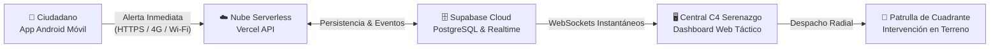

# AFICHE DESCRIPTIVO DE LA SOLUCIÓN
## ALERTA GUADALUPE • SEGURIDAD CIUDADANA Y DESPACHO CERO

---

### 1. Visión General de la Solución
**Alerta Guadalupe** es un ecosistema tecnológico cívico diseñado para conectar de manera instantánea y georreferenciada a los vecinos del **Distrito de Guadalupe (Provincia de Pacasmayo, La Libertad)** con la Central de Operaciones de **Serenazgo y Seguridad Ciudadana**.

El sistema elimina las llamadas telefónicas tradicionales lentas y saturadas, permitiendo que cualquier vecino en situación de riesgo reporte un incidente con **un solo toque**, transmitiendo su posición GPS exacta, datos verificados y evidencia multimedia directamente a las pantallas de los despachadores de Serenazgo en menos de **500 milisegundos**.

---

### 2. Flujo Operativo y Arquitectura

---

### 3. Componentes Principales del Sistema

#### A. Aplicativo Móvil Ciudadano (Android Nativo)
- **Registro Ciudadano Seguro**: Validación obligatoria de DNI (8 dígitos), nombres completos y teléfono celular para erradicar llamadas falsas y dar legitimidad al reporte.
- **Acceso Táctico a 3 Niveles de Incidencia**:
  1. 🚨 **Emergencia Inmediata** (Rojo): Peligro inminente de vida, accidentes graves, asaltos en curso.
  2. ⚠️ **Alerta Seguridad** (Azul): Robos, grescas callejeras, actos vandálicos.
  3. 👁️ **Actitud Sospechosa** (Naranja): Sujetos vigilando cerraduras, vehículos sospechosos sin placa merodeando la zona.
- **Geolocalización Automática de Alta Precisión**: Uso de *Google Play Services Fused Location Provider* para obtener latitud y longitud satelital con referencia barrial automática.
- **Cámara y Evidencia Multimedia**: Capacidad de adjuntar fotos o videos capturados en el instante como prueba visual para las patrullas.

#### B. Central Web C4 Serenazgo (Monitoreo y Despacho)
- **Mapa Táctico Interactivo (Leaflet & OpenStreetMap)**: Cobertura total de la planta urbana y rural del distrito de Guadalupe con marcadores animados según el tipo de delito.
- **Malla Táctica de 12 Cuadrantes**: Delimitación poligonal de sectores (C-01 Plaza de Armas, C-02 San Ramón, C-06 Mercado Modelo, C-04 Estadio, etc.) con filtros rápidos de incidentes por zona.
- **Alerta Sonora y Visual Inmediata**: Notificación sonora tipo sirena/chime diferenciada y banners emergentes de atención prioritaria.
- **Historial y Ficha de Incidencia**: Hoja de detalle con tiempo transcurrido, contacto directo del vecino, coordenadas y enlace directo para unidades de patrullaje.

#### C. Núcleo en la Nube (Vercel + Supabase)
- **Disponibilidad 24/7 y Costo Cero**: Arquitectura 100% *Serverless* alojada globalmente sin necesidad de servidores físicos costosos ni mantenimiento de hardware local.
- **Base de Datos PostgreSQL de Alta Velocidad**: Respaldo permanente de cada incidente con políticas de seguridad a nivel de fila (*Row Level Security*).
- **WebSockets en Tiempo Real**: Distribución de eventos de emergencia a múltiples pantallas de serenazgo en simultáneo sin latencia ni cuellos de botella.

---

### 4. Ficha Técnica de la Plataforma

| Componente | Tecnología | Rol en la Solución |
| :--- | :--- | :--- |
| **App Móvil** | Kotlin, Jetpack Compose, Coroutines, OkHttp3 | Interfaz ciudadana nativa rápida, intuitiva y resiliente |
| **Dashboard Web** | React 19, Vite, TailwindCSS, Leaflet | Central de monitoreo táctico C4 multi-pantalla |
| **API en la Nube** | Node.js Serverless Functions en **Vercel** | Ingesta, validación y enrutamiento perimetral con HTTPS |
| **Base de Datos** | PostgreSQL & WebSockets en **Supabase** | Persistencia transaccional segura y push en tiempo real |
| **Cobertura** | Distrito de Guadalupe, La Libertad, Perú | Malla sectorizada de 12 Cuadrantes Tácticos de Serenazgo |

---

### 5. Protocolo de Respuesta ante una Emergencia

1. **Activación**: El vecino presiona el botón de pánico en su smartphone.
2. **Transmisión**: En milisegundos, el teléfono envía el reporte cifrado por 4G o Wi-Fi al enlace seguro `https://alerta-guadalupe.vercel.app`.
3. **Recepción en C4**: El mapa de la Central de Serenazgo emite la alarma auditiva y focaliza automáticamente el cuadrante donde se originó el hecho.
4. **Despacho Inmediato**: El operador visualiza el nombre y teléfono del vecino, el tipo de emergencia y despacha la camioneta o motorizado asignado al cuadrante para una intervención oportuna.
